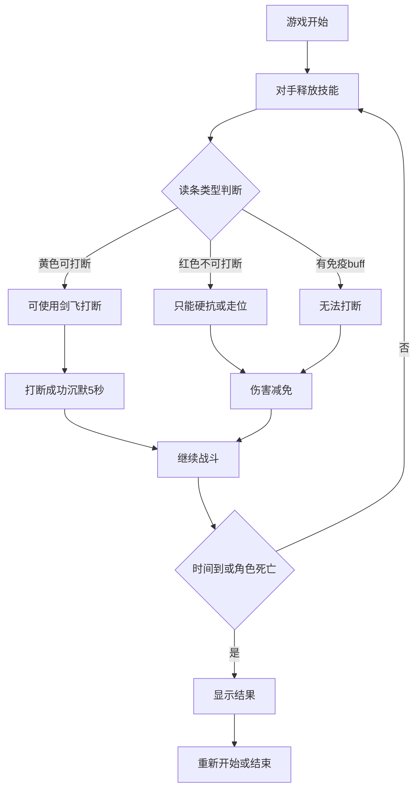

## 1. 产品概述
剑网三练剑飞是一款基于剑网三纯阳门派剑飞技能机制的1v1反应速度训练游戏。玩家需要准确判断对手读条时机，使用剑飞技能打断关键技能并沉默对手。
- 目标用户：剑网三玩家、动作游戏爱好者、反应速度训练者
- 核心价值：提升玩家对读条机制的识别和反应能力，增强PVP竞技技巧

## 2. 核心功能

### 2.1 用户角色
| 角色 | 注册方式 | 核心权限 |
|------|----------|----------|
| 玩家 | 无需注册，直接进入游戏 | 进行游戏对战、查看战斗记录 |

### 2.2 功能模块
游戏包含以下核心页面：
1. **游戏主页面**：战斗场景、角色状态、技能栏、读条显示
2. **游戏结束页面**：战斗结果、数据统计、重新开始

### 2.3 页面详情
| 页面名称 | 模块名称 | 功能描述 |
|----------|----------|----------|
| 游戏主页面 | 战斗场景 | 显示玩家和对手角色模型、位置布局 |
| 游戏主页面 | 角色状态栏 | 显示双方血量条、血量百分比、buff图标 |
| 游戏主页面 | 读条系统 | 显示对手技能读条（黄色可打断/红色不可打断、正向/逆向） |
| 游戏主页面 | 技能栏 | 普攻按钮、读条技能按钮、剑飞技能按钮、减伤技能按钮（CD 10秒，持续2秒）及冷却显示 |
| 游戏主页面 | 战斗计时 | 显示剩余战斗时间（2分钟） |
| 游戏主页面 | 战斗日志 | 显示关键战斗事件（打断成功、技能释放等） |
| 游戏结束页面 | 结果显示 | 显示胜利/失败、剩余血量百分比 |
| 游戏结束页面 | 数据统计 | 显示打断成功率、受到伤害、输出伤害 |
| 游戏结束页面 | 重新开始 | 按钮重新开始新一局游戏 |

## 3. 核心流程
游戏开始 → 对手随机释放技能 → 玩家判断读条类型 → 选择技能应对 → 2分钟结束或角色死亡 → 结果显示

## 4. 用户界面设计

### 4.1 设计风格
- **主色调**：传统武侠风格，以墨绿(#2d5016)、金黄(#d4af37)、深红(#8b0000)为主
- **按钮样式**：圆角矩形，带有中式边框装饰，悬停时有光影效果
- **字体**：思源黑体为主，技能名称使用楷体增强武侠感
- **布局风格**：上下分栏式，上方为战斗场景，下方为操作界面
- **图标风格**：扁平化+国风元素，技能图标带有太极、剑等传统文化符号

### 4.2 页面设计概述
| 页面名称 | 模块名称 | UI元素 |
|----------|----------|--------|
| 游戏主页面 | 战斗场景 | 背景为传统中式庭院，角色为2D立绘，左右对立布局，带有光影效果 |
| 游戏主页面 | 血量条 | 绿色渐变条，上方显示具体数值，宽度占屏幕80%，居中显示 |
| 游戏主页面 | 读条系统 | 黄色读条(#ffd700)表示可打断，红色读条(#dc143c)表示不可打断，带有进度动画 |
| 游戏主页面 | 技能栏 | 底部横向排列，剑飞技能突出显示，冷却时变为灰色，倒计时数字显示 |
| 游戏结束页面 | 结果展示 | 大字体显示胜利/失败，背景为淡金色或淡红色，带有传统纹样装饰 |

### 4.3 响应式设计
- **设计原则**：移动端优先（Mobile First），兼容桌面端竖屏模式
- **分辨率支持**：优先适配手机竖屏主流分辨率，桌面端通过居中容器展示手机比例界面