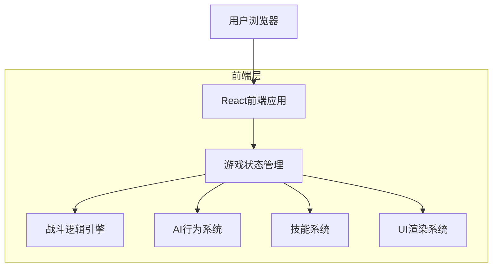
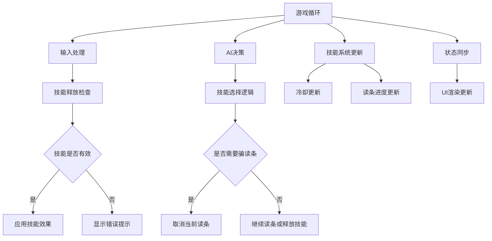

## 1. 架构设计



## 2. 技术描述
- **前端框架**：React@18 + TypeScript@5 + Vite@5
- **初始化工具**：vite-init
- **状态管理**：Zustand@4（轻量级状态管理）
- **UI框架**：TailwindCSS@3 + HeadlessUI（移动端优先响应式设计）
- **动画库**：Framer-motion@10（技能特效和读条动画）
- **图标库**：Lucide-react@0.300+
- **后端**：无（纯客户端游戏）

## 3. 路由定义
| 路由 | 用途 |
|------|------|
| / | 游戏主页面，显示战斗场景和UI |
| /game-over | 游戏结束页面，显示结果和统计 |

## 4. 核心数据类型定义

### 4.1 角色状态
```typescript
interface Character {
  id: string;
  name: string;
  hp: number;
  maxHp: number;
  buffs: Buff[];
  isCasting: boolean;
  castSkill: Skill | null;
  castProgress: number; // 0-100
  castDirection: 'forward' | 'reverse';
  globalCooldownEndTime: number; // 公共CD结束时间戳
  silenceEndTime: number; // 沉默结束时间戳
}

interface Buff {
  id: string;
  name: string;
  type: 'immune_interrupt' | 'immune_silence' | 'damage_reduction';
  duration: number; // 毫秒
  endTime: number; // 时间戳
  icon: string;
}
```

### 4.2 技能系统
```typescript
interface Skill {
  id: string;
  name: string;
  type: 'normal' | 'charge' | 'interrupt' | 'defensive';
  damage: number;
  castTime: number; // 毫秒，0表示瞬发
  cooldown: number; // 毫秒
  lastUsedTime: number; // 时间戳
  canInterrupt: boolean; // 是否能被打断
  isGcdTrigger: boolean; // 是否触发公共CD
  gcd: number; // 公共CD时间（通常1500ms）
  damageReduction?: number; // 减伤比例 (0-1)
  color: 'yellow' | 'red'; // 读条颜色
}

interface PlayerSkill extends Skill {
  isAvailable: boolean;
  cooldownRemaining: number; // 剩余冷却时间
}
```

### 4.3 游戏状态
```typescript
interface GameState {
  status: 'playing' | 'paused' | 'ended';
  startTime: number;
  duration: number; // 游戏总时长（毫秒）
  winner: 'player' | 'ai' | 'tie' | null;
  player: Character;
  ai: Character;
  combatLog: CombatEvent[];
}

interface CombatEvent {
  timestamp: number;
  type: 'skill_cast' | 'interrupt_success' | 'damage_dealt' | 'buff_applied';
  source: 'player' | 'ai';
  target: 'player' | 'ai';
  skillName: string;
  value?: number; // 伤害值等
}
```

## 5. 游戏逻辑架构



## 6. 关键算法设计

### 6.1 AI行为决策
```typescript
class AIDecisionEngine {
  selectSkill(ai: Character, player: Character): Skill {
    // 基础权重计算
    const weights = this.calculateSkillWeights(ai.skills, player);

    // 红色读条技能且伤害高，尝试开启减伤
    if (player.isCasting && player.castSkill?.color === 'red' && player.castSkill.damage > 80) {
      const defensiveSkill = ai.skills.find(s => s.type === 'defensive');
      if (defensiveSkill && defensiveSkill.isAvailable) {
        return defensiveSkill;
      }
    }
    
    // 骗读条逻辑（20%概率）
    if (Math.random() < 0.2 && this.canFakeCast(ai, player)) {
      return this.selectFakeCastSkill(ai.skills);
    }
    
    // 根据权重选择技能
    return this.selectByWeight(weights);
  }
  
  private calculateSkillWeights(skills: Skill[], player: Character): number[] {
    return skills.map(skill => {
      let weight = skill.damage; // 基础伤害权重
      
      // 玩家有打断技能时，降低高价值技能权重
      if (player.skills.some(s => s.type === 'interrupt' && s.cooldownRemaining < 2000)) {
        if (skill.canInterrupt && skill.damage > 50) {
          weight *= 0.3;
        }
      }
      
      return weight;
    });
  }
}
```

### 6.2 打断判定逻辑
```typescript
function tryInterrupt(caster: Character, target: Character, skill: Skill): InterruptResult {
  // 检查目标是否在施法
  if (!target.isCasting || !target.castSkill) {
    return { success: false, reason: 'target_not_casting' };
  }
  
  // 检查目标技能是否可打断
  if (!target.castSkill.canInterrupt) {
    return { success: false, reason: 'skill_not_interruptible' };
  }
  
  // 检查目标是否有免疫打断buff
  const hasImmune = target.buffs.some(buff => buff.type === 'immune_interrupt');
  if (hasImmune) {
    return { success: false, reason: 'target_immune' };
  }
  
  // 成功打断
  return { 
    success: true, 
    silenceDuration: 5000, // 5秒沉默
    reason: 'interrupt_success' 
  };
}
```